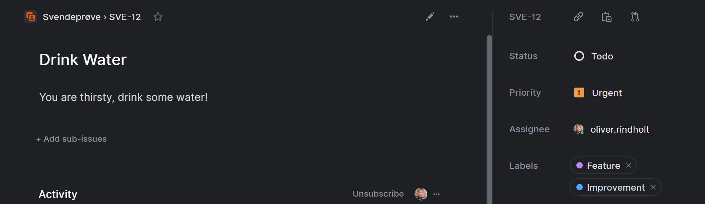
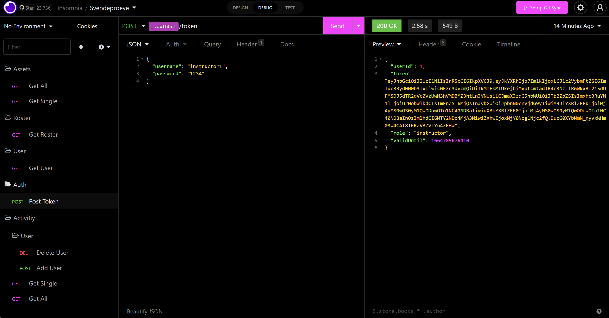

# Dokumentation

## Tech-stack

### Grundlæggende Tech

- **HTML (HyperText Markup Language)**
- **CSS (Cascading Style Sheets)**
- **Javascript**

### Core Frameworks

**Tailwind CSS** - _Et utility-first css framework, som gør det hurtigt at lave meget styling_

> **Tailwind CSS** er et css framework, der leverer en masse "out-of-the-box" classes med prædefineret styling. Tailwind giver også mulighed for at angive custom utility classes i deres konfiguration, så det er nemt at adaptere en styleguide. Derudover er Tailwind super lightweight, og kan tilpasses langt mere I forhold til fx. Boostrap.

```html
<div className="p-4 bg-gray-600 text-white"></div>
```

\- Eksempel på Tailwind utility classes

### Core libraries

- **React.js** - _Et Javascript bibliotek som gør det lettere og hurtigere at bygge user interfaces_
  > XXXX

### Core packets

- **Axios** - _Et alternativ til fetch API'et_
  > **Axios** tilbyder mere funktionalitet, en simplere og mere effektiv syntax, har bedre browser kompatibilitet, og gør det nemt, og hurtigere at lave HTTP requests, i forhold til fx. Fetch API'et, som har en lang syntax og har unødvendige method chaining til fx. formattering af data.
- **Yup** - _Simpel schema builder til værdi parsing og validering_
  > **Yup** er en schema-builder, som tilbyder et bredt og kortfattet object interface med simple prædefineret regler, samt muligheden for at bygge kompliceret validering, indebygget async validering, med en simpel syntax, som er let at forstå og skrive. Yup er en hurtig og simpel løsning, til et ellers besværligt problem.
- **React Hook Form** - _Form validering med god performance_
  > **React Hook Form** formindsker mængden af kode nødvendig for en sikker og effektiv løsning til form validering. Med React Hook Form, I forhold til fx. Formik, har det færre dependencies, og laver færre rerenders, hvilket gør din app hurtigere og giver brugeren en bedre "user-experience".
- **Fuse.js** - _Et hurtigt og simpelt fuzzy search bibliotek_
  > **Fuse.js** er et kraftfuld men lightweight fuzzy-search bibliotek, som giver mulighed for at implementere "approximate string matching" i fx. filtrering en søge funktion, et ellers svært emne at tilgå, hvis man skulle lave det fra bunden.
- **React Router Dom** - _Et lightweight, routing bibliotek_
  > XXXX
- **React-Testing-Libary** - _XXXX_
  > XXXX
- **Toastify** - _XXXX_
  > XXXX

## Process

### Kanban - (Linear)

For at skrukturere mit project, og for at holde overblik, har jeg gjort brug af kanban metoden, via. Linear, som er et program som gør brug af et "board", og integereres nemt med Github vha. webhooks. Det fungerer sådan at boardet er sat op i kolonner - (backlog, todo, in progress, done). Kolonner bliver løbende fyldt af **"issues/tasks"**, for at holde overblik over de ting der skal laves.


\- Eksempel på Linear **issue**

Når du har lavet din issue, og skal igang med at arbejde på den, kan man kopiere git branch navnet (som er en slags "_slug_" for issuet), og lave en branch i navnet, den vil derefter blive forbundet til Linear, så at issuet følger med processen af branchen.<br/>Todo - In progress (PR) - Done (Merged).


\- Eksempel på Linear branch interaktion

`git checkout -b oliverrindholt/sve-12-drink-water`

### Git - (Github)

Git gør organisering af projekter kode mere effektivt, og gør det nemt at kigge tilbage på mit tidligere arbejde.

`git add .`

`git commit -m "message"`

`git push`

### Continuous Deployment

Netlify - _Forbundet til Github således at når man pusher til det forbundet repo, bygger den din kode for dig, og fanger alle fejl du kunne have misset._

### API Testing

Insomnia - XXXX


## Udvalgt kode til vudering

```js

```

## Forbedringer

### Skalering

- Hvordan fungerer React?
  > XXXX
- Cookies permission
- Mere testing

## Ekstra Opgaver

Jeg har valgt at lave:

- Ekstra opagve A
- Ekstra opagve B
- Ekstra opagve C
